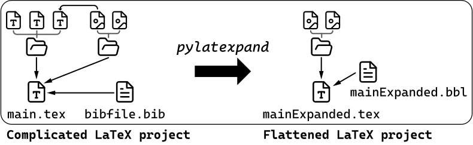

[](https://python.org)
[](https://github.com/bernwo/pylatexpand)

# PyLaTeXpand

A convenient wrapper for `latexpand` and `bibtex` that flattens your complicated LaTeX project into a single `.tex` file.

## Overview of how it works

<p align="center">
  
</p>

## Usage example

The following animation replicates the [image shown above](#overview-of-how-it-works).
This step is also exactly the one shown in [`Example > RevTeX4-2 tex project (without .bbl embedding)`](#revtex4-2-tex-project-without-bbl-embedding) below.

<p align="center">
  <video width="640" height="320" src="https://github.com/bernwo/pylatexpand/assets/53580103/109bf8ab-d99b-4764-957b-f133f2e5796a"></video>
</p>

# Prerequisites

You should have both `latexpand` and `bibtex` installed and added to your system path. If not, you should install TeX Live 2023 (or later) which includes all necessary LaTeX tools.

## Windows

Obtain an `.iso` image file from `https://ftp.fau.de/ctan/systems/texlive/Images/`, mount it, and run the installer `.bat` file. Installation should take about an hour depending on the specs of your computer.

## Mac

TeX Live has a version specifically for macOS users, called `MacTeX`. You can obtain the installer from `https://tug.org/mactex/mactex-download.html` and follow the steps to install it. The tools should automatically be added to your system path.

## Linux

You're using Linux, ∴ you should know what you're doing ;)

# Installation

After you have both `latexpand` and `bibtex` installed, you can proceed to installing `pylatexpand`. The steps listed here should apply to Windows, macOS, and Linux.

## From the Python Package index

```shell
pip install pylatexpand
```

## From the `main` branch on Github

```shell
pip install https://github.com/bernwo/pylatexpand/archive/main.zip
```

## Uninstallation

To uninstall, simply run

```shell
pip uninstall -y pylatexpand
```

# Usage

If installation is successful, you can run the following in your terminal

```shell
pylatexpand --help
```

and you should see the following output

```pwsh
usage: pylatexpand [-h] -i INPUT_MAIN_TEX_FILE [-C TEMPORARY_WORKING_DIRECTORY] [-E EXPANDED_TEX_FILENAME] [--embed-bbl | --no-embed-bbl]

Python wrapper for latexpand and bibtex

options:
  -h, --help            show this help message and exit
  -i INPUT_MAIN_TEX_FILE, --input-main-tex-file INPUT_MAIN_TEX_FILE
                        name of the input tex file. File extension is optional
  -C TEMPORARY_WORKING_DIRECTORY, --temporary-working-directory TEMPORARY_WORKING_DIRECTORY
                        temporarily change to your desired working directory
  -E EXPANDED_TEX_FILENAME, --expanded-tex-filename EXPANDED_TEX_FILENAME
                        expanded tex filename
  --embed-bbl, --no-embed-bbl
                        whether to embed `.bbl` file within the expanded `.tex` file or not (default=False). Note that the generation of `.bbl` is always automated.
                        This option is ignored if no `\bibliography{...}` is found within the input main `.tex` file.

Written by Wo
```

## Examples

Clone the repository

```shell
git clone https://github.com/bernwo/pylatexpand.git
```

`cd` into the root directory of the cloned repository, and then you can run the following examples. If successful, you should see `mainExpanded.tex` file being created.

### RevTeX4-2 tex project (with .bbl embedding)

```shell
pylatexpand -C tests/tex_project_revtex4-2 -i main.tex --embed--bbl
```

### RevTeX4-2 tex project (without .bbl embedding)

```shell
pylatexpand -C tests/tex_project_revtex4-2 -i main.tex --no-embed--bbl
```

### Assignment tex project

```shell
pylatexpand -C tests/tex_project_assignment -i main.tex
```

# Running tests

After cloning the repository as detailed above, you can run the tests via the command

```shell
pytest tests
```

If the installation is successful, you should see all test cases passing. Note that you need to install `pytest` first to run this command. You can install it via `pip install pytest`.
